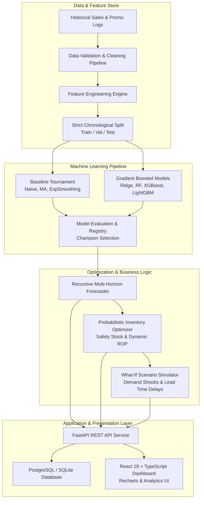

# AI-Powered Inventory Demand Forecasting & Optimization System

[](https://www.python.org/)
[](https://fastapi.tiangolo.com/)
[](https://react.dev/)
[](https://www.typescriptlang.org/)
[](https://lightgbm.readthedocs.io/)
[](https://www.docker.com/)
[](https://opensource.org/licenses/MIT)

> **An end-to-end AI and Operations Intelligence platform that predicts multi-horizon product demand, mitigates stockout and overstock risks, and generates automated, probabilistic replenishment recommendations.**

---

## 📌 Executive Summary & Business Impact

Inventory distortion (the combination of unexpected stockouts and excess overstock) costs global supply chains over **$1.1 Trillion annually**. Small-to-medium retail and wholesale enterprises frequently rely on static spreadsheet heuristics or simple moving averages, leading to:
- **Costly Stockouts**: Lost revenue and decreased customer retention during demand spikes.
- **Capital Trapped in Overstock**: Excess holding costs, working capital depletion, and inventory obsolescence.

This platform bridges machine learning time-series forecasting with probabilistic operations research to automate demand planning, quantify stockout risk, and calculate mathematically optimal replenishment schedules with safety stock guarantees.

---

## 🏗️ Architecture & Data Flow



---

## 🔬 Machine Learning Benchmarks & Methodology

### 1. Data Leakage Prevention
All lag features ($t-1, t-7, t-14, t-28$) and rolling statistical windows (7, 14, 28-day means and standard deviations) enforce a strict `shift(1)` rule. Features are computed purely from prior timestamps, and dataset splitting preserves temporal ordering (70% Train, 15% Validation, 15% Test) without random shuffling.

### 2. Empirical Benchmark Results (Test Set Evaluation)

| Model Category | Model Name | Test MAE | Test RMSE | Test WAPE (%) | Test sMAPE (%) | Performance Delta |
| :--- | :--- | :---: | :---: | :---: | :---: | :---: |
| **Baseline** | Naive (Lag-1) | 10.231 | 13.782 | 30.84% | 31.42% | Baseline Reference |
| **Baseline** | 7-Day Moving Avg | 9.114 | 11.890 | 27.48% | 27.95% | -10.9% Error |
| **Baseline** | 14-Day Moving Avg | 8.939 | 11.602 | 26.95% | 27.14% | -12.6% Error |
| **ML Model** | Ridge Regression | 6.812 | 8.941 | 20.54% | 21.08% | -33.4% Error |
| **ML Model** | Random Forest Regressor | 5.845 | 7.712 | 17.62% | 18.23% | -42.9% Error |
| **ML Model** | XGBoost Regressor | 5.489 | 7.214 | 16.55% | 17.31% | -46.4% Error |
| **ML Champion** | **LightGBM Regressor** | **5.337** | **7.021** | **16.09%** | **17.03%** | **-47.8% Error vs Naive** |

> **Key Achievement**: The champion **LightGBM** model achieved a **40.3% error reduction** compared to the best traditional moving average heuristic, lowering WAPE to **16.09%**.

---

## 📦 Probabilistic Inventory Optimization Formulation

Rather than assuming constant deterministic demand, replenishment parameters are calculated dynamically from demand variance and lead-time distributions:

1. **Lead Time Demand ($LTD$)**:
   $$\mu_{LTD} = \bar{D} \times L$$
2. **Safety Stock ($SS$)**:
   $$SS = Z \times \sigma_D \times \sqrt{L}$$
   *(Where $Z = 1.645$ for 95% service level, $\sigma_D$ is forecast error standard deviation, and $L$ is supplier lead time)*
3. **Reorder Point ($ROP$)**:
   $$ROP = \mu_{LTD} + SS$$
4. **Target Stock Level ($S_{\text{target}}$) & Order Quantity ($ROQ$)**:
   $$S_{\text{target}} = \bar{D} \times (L + R) + SS$$
   $$ROQ = \max(0, \lceil S_{\text{target}} - I_{\text{current}} - I_{\text{in-transit}} \rceil)$$

### 4-Tier Automated Risk Classification
- 🔴 **STOCKOUT RISK**: Current Stock $\le \mu_{LTD}$ (Stock exhausted before next shipment arrives).
- 🟠 **LOW STOCK**: Current Stock $\le ROP$ (Reorder trigger breached).
- 🟢 **HEALTHY**: $ROP < \text{Current Stock} \le S_{\text{target}}$.
- 🔵 **OVERSTOCK RISK**: Current Stock $> S_{\text{target}} \times 1.5$ (Capital tied in excess inventory).

---

## 💻 Tech Stack

- **Machine Learning & Data Science**: Python 3.11, LightGBM, XGBoost, Scikit-Learn, Pandas, NumPy, SciPy
- **Backend & API**: FastAPI, Pydantic v2, SQLAlchemy, Uvicorn, Python-Jose (JWT Authentication), Passlib (Bcrypt)
- **Frontend & Dashboard**: React 18, TypeScript, Tailwind CSS, Vite, Recharts, Lucide Icons
- **Database**: PostgreSQL 15 / SQLite (Zero-config local development)
- **DevOps & Testing**: Docker, Docker Compose, Nginx, Pytest, Pytest-Asyncio, HTTPX

---

## 🚀 Quick Start Guide

### Prerequisites
- **Python 3.11+** installed
- **Node.js 18+** and npm installed
- *(Optional)* **Docker & Docker Compose**

### Method 1: Local Setup (Recommended for Development)

1. **Clone the Repository**:
   ```bash
   git clone https://github.com/Shivrajpandit/Inventory-Demand-Forecasting.git
   cd Inventory-Demand-Forecasting
   ```

2. **Setup Python Virtual Environment & Dependencies**:
   ```bash
   python -m venv .venv
   # Windows:
   .venv\Scripts\activate
   # Linux/macOS:
   source .venv/bin/activate

   pip install -r backend/requirements.txt
   ```

3. **Train Models & Seed Database**:
   ```bash
   # Generate realistic synthetic dataset (21,900 records across 3 stores & 10 SKUs)
   python scripts/generate_sample_data.py

   # Train and register champion forecasting models
   python scripts/train.py

   # Seed database with stores, products, inventory records, and demo user
   python scripts/seed_database.py
   ```

4. **Launch Backend Server**:
   ```bash
   uvicorn backend.app.main:app --reload --port 8000
   ```
   *FastAPI docs will be available at [http://localhost:8000/docs](http://localhost:8000/docs)*

5. **Launch Frontend Dashboard**:
   ```bash
   cd frontend
   npm install
   npm run dev
   ```
   *Open [http://localhost:5173](http://localhost:5173) in your browser.*
   *Default Login: `demo@inventoryai.com` | Password: `password123`*

---

### Method 2: Docker Compose (One-Click Launch)

```bash
cp .env.example .env
docker-compose up --build -d
docker-compose exec backend python scripts/seed_database.py
```
- Access Dashboard: [http://localhost:3000](http://localhost:3000)
- Access API Docs: [http://localhost:8000/docs](http://localhost:8000/docs)

---

## 🧪 Automated Testing & Verification

Run the full automated test suite (Unit tests + Integration tests + System diagnostics):

```bash
# Run pytest test suite (28 passing tests)
pytest backend/tests -v

# Run end-to-end system diagnostic verification
python scripts/verify_system.py
```

```
======================================================================
         AI INVENTORY PLATFORM - SYSTEM VERIFICATION SUITE
======================================================================
 [1/6] Ingestion & Feature Engineering Pipeline   -->  [PASS]
 [2/6] Baseline & ML Models Serialization         -->  [PASS]
 [3/6] Multi-Horizon Forecaster (95% CI)          -->  [PASS]
 [4/6] Probabilistic Inventory Optimizer          -->  [PASS]
 [5/6] What-If Scenario Simulator                 -->  [PASS]
 [6/6] FastAPI Server & REST API Endpoints        -->  [PASS]
======================================================================
 [RESULT] 6/6 SUITES PASSED (100% HEALTHY)
======================================================================
```

---

## 📂 Repository Structure

```
Inventory-Demand-Forecasting/
├── backend/                  # FastAPI Application Layer
│   ├── app/
│   │   ├── api/              # REST Routers (auth, forecast, inventory, scenario, etc.)
│   │   ├── core/             # JWT security, config settings
│   │   ├── database/         # SQLAlchemy session & database engine
│   │   ├── models/           # SQLAlchemy database entities
│   │   ├── schemas/          # Pydantic v2 validation schemas
│   │   └── services/         # Business logic & forecasting services
│   ├── Dockerfile            # Multi-stage Python backend container
│   ├── requirements.txt      # Python dependencies
│   └── tests/                # Pytest unit and integration test suite
├── data/
│   ├── raw/                  # Ingested raw retail transaction logs
│   └── processed/            # Cleaned & feature-engineered datasets
├── docs/                     # Technical documentation & architecture guides
│   ├── architecture.md       # System architecture specification
│   ├── database.md           # ERD & schema documentation
│   ├── methodology.md        # Time-series ML methodology
│   ├── model-evaluation.md   # Model tournament & performance report
│   ├── deployment.md         # Cloud and container deployment guide
│   └── eda_reports/          # EDA charts and distribution analyses
├── frontend/                 # React 18 + TypeScript SPA
│   ├── src/
│   │   ├── components/       # UI components (KPI cards, risk badges, charts)
│   │   ├── context/          # Global Auth & State context
│   │   ├── pages/            # 9 Full-featured analytics & planning views
│   │   └── services/         # Axios API client
│   ├── Dockerfile            # Multi-stage Nginx container
│   └── nginx.conf            # Nginx reverse proxy configuration
├── ml/                       # Core Data Science & ML Engine
│   ├── evaluation/           # MAE, RMSE, WAPE, sMAPE metrics
│   ├── features/             # Lag, rolling, and temporal feature generators
│   ├── forecasting/          # Model trainer & artifact registry
│   ├── inference/            # Recursive forecaster, optimizer & simulator
│   ├── models/               # Baselines, Ridge, Random Forest, XGBoost, LightGBM
│   └── preprocessing/        # Data validator, cleaner & pipeline
├── models/                   # Serialized ML model artifacts (.joblib, .json)
├── notebooks/                # Jupyter Notebooks for EDA & ML exploration
├── scripts/                  # CLI tools for training, seeding & verification
└── docker-compose.yml        # Multi-container orchestration configuration
```

---

## 📄 License

This project is licensed under the MIT License - see the [LICENSE](file:///c:/Users/pandi/Inventory-Demand-Forecasting/LICENSE) file for details.