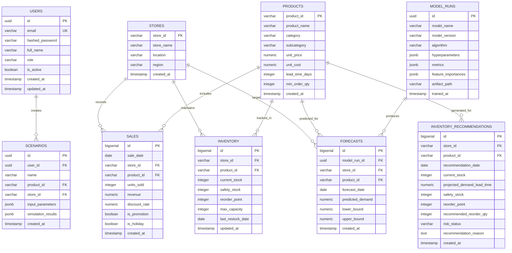

# Database Schema Specification

## Relational Database Design (PostgreSQL)

The system uses a normalized PostgreSQL relational database to store business entities, granular daily sales records, current inventory positions, forecasting runs, and generated recommendations.

---

## Table Definitions & Indexing Strategy

### 1. `users`
- Stores user accounts for dashboard access and API authentication.
- **Indexes**: `UNIQUE INDEX idx_users_email (email)`.

### 2. `stores` & `products`
- Master entity catalogs representing physical/virtual storefronts and SKU metadata (costs, prices, default lead times, packaging constraints).
- **Indexes**: `INDEX idx_products_category (category)`.

### 3. `sales`
- High-volume transaction log containing historical daily aggregate unit sales per product and store.
- **Indexes**:
  - `UNIQUE INDEX idx_sales_date_store_prod (sale_date, store_id, product_id)`
  - `INDEX idx_sales_store_prod (store_id, product_id)`
  - `INDEX idx_sales_date (sale_date)`

### 4. `inventory`
- Real-time stock levels, current inventory buffer metrics, and storage capacities.
- **Indexes**: `UNIQUE INDEX idx_inventory_store_prod (store_id, product_id)`.

### 5. `model_runs` & `forecasts`
- Full lineage tracking of trained ML models, evaluation metrics (MAE, RMSE, sMAPE), and multi-horizon point forecasts.
- **Indexes**:
  - `INDEX idx_forecasts_lookup (store_id, product_id, forecast_date)`
  - `INDEX idx_forecasts_model_run (model_run_id)`

### 6. `inventory_recommendations`
- Actionable business intelligence derived from model forecasts combined with inventory business rules.
- **Risk Statuses**: `HEALTHY`, `LOW_STOCK`, `STOCKOUT_RISK`, `OVERSTOCK_RISK`.
- **Indexes**: `INDEX idx_recommendations_store_risk (store_id, risk_status)`.

### 7. `scenarios`
- Sandbox simulations allowing business planners to test demand shocks, price elasticity, and lead time disruptions.
